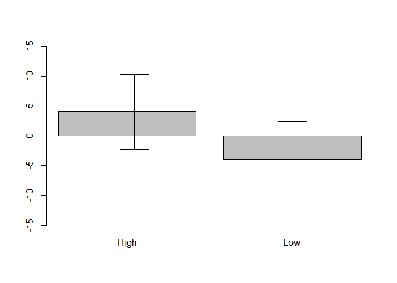
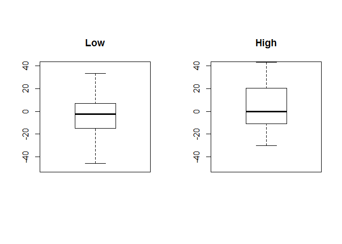
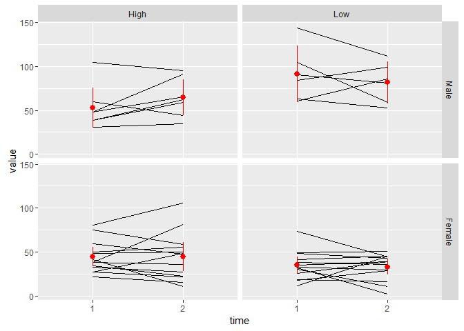
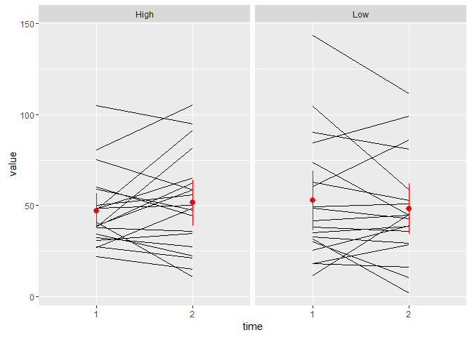

Analysis of power pose data
================
Shravan Vasishth
1 October 2016

Load and prepare data
---------------------

``` r
## cleaned data
datc <- read.csv("ccy-clean-data.csv", header = TRUE)

# two alternate factor codings for gender
datc$gender_female <- datc$female
datc$gender_male <- relevel(datc$gender_female, "Male")

# testosterone diff
datc$test_diff <- datc$testm2 - datc$testm1

## sanity check: one subject, one row
dim(datc)
#> [1] 47 44
length(unique(datc$id))
#> [1] 47

# drop ineligible and something else as in stata code:
unique(datc$inelig)
#> [1] Ineligible (drop)      Analytic sample (keep)
#> Levels: Analytic sample (keep) Ineligible (drop)
unique(datc$anyoutv1)
#> [1] Not selected Selected    
#> Levels: Not selected Selected
datc <- subset(datc, inelig != "Ineligible (drop)" & anyoutv1 != "Selected")
```

Examine male and female testosterone levels
-------------------------------------------

``` r
## subset males and females
males <- subset(datc, female == "Male")
females <- subset(datc, female == "Female")

## initial testosterone:
summary(males$testm1)
#>    Min. 1st Qu.  Median    Mean 3rd Qu.    Max. 
#>   30.99   47.81   60.56   70.47   90.37  143.60
summary(females$testm1)
#>    Min. 1st Qu.  Median    Mean 3rd Qu.    Max. 
#>   11.65   27.98   36.57   39.53   48.56   80.69

## after treatment:
summary(males$testm2)
#>    Min. 1st Qu.  Median    Mean 3rd Qu.    Max. 
#>   34.78   58.69   65.15   72.38   91.32  111.60
summary(females$testm2)
#>    Min. 1st Qu.  Median    Mean 3rd Qu.    Max. 
#>   2.145  23.700  38.780  38.820  48.270 105.500
```

Calculate mean post-treatment testosterone by gender
----------------------------------------------------

``` r
# mean and 95% CI, rounded to 1 digit
mean_se1 <- function(...) round(Hmisc::smean.cl.normal(...), 1)

aggregate(testm2 ~ gender_female + hptreat, datc, mean_se1)
#>   gender_female hptreat testm2.Mean testm2.Lower testm2.Upper
#> 1        Female    High        44.7         28.2         61.1
#> 2          Male    High        64.5         44.0         85.1
#> 3        Female     Low        33.0         23.9         42.0
#> 4          Male     Low        81.5         57.7        105.3

aggregate(testm2 ~ hptreat, datc, mean_se1)
#>   hptreat testm2.Mean testm2.Lower testm2.Upper
#> 1    High        51.6         39.1         64.2
#> 2     Low        48.3         34.4         62.2
```

By how much did testosterone increase after treatment? Means by gender.

``` r
## difference scores:
round(with(datc, tapply(testm2 - testm1, IND = list(female, hptreat), mean)))
#>        High Low
#> Female    1  -2
#> Male     12 -10

aggregate(test_diff ~ hptreat + gender_female, datc, mean_se1)
#>   hptreat gender_female test_diff.Mean test_diff.Lower test_diff.Upper
#> 1    High        Female            0.6           -11.2            12.4
#> 2     Low        Female           -2.0           -12.4             8.4
#> 3    High          Male           11.7            -7.2            30.7
#> 4     Low          Male           -9.5           -37.7            18.6
```

Means ignoring gender: here is the rough and ready version of fig 3 of the paper. The effects are a bit smaller in this data-set than the published result, probably because of the statistician's cleaning up of the data.

``` r
aggregate(test_diff ~ hptreat, datc, mean_se1)
#>   hptreat test_diff.Mean test_diff.Lower test_diff.Upper
#> 1    High            4.5            -4.9            13.9
#> 2     Low           -4.4           -14.1             5.4

(means <- round(with(datc, tapply(testm2 - testm1, IND = hptreat, mean))))
#> High  Low 
#>    4   -4
(sds <- with(datc, tapply(testm2 - testm1, IND = hptreat, sd)))
#>     High      Low 
#> 20.07414 20.27339
n <- length(datc$testm2)
ses <- sds/sqrt(n)

barplot(means, ylim = c(-15, 15))
arrows(x0 = 0.75, x1 = 0.75, y0 = means[1] - 1.96 * ses[1], y1 = means[1] + 
    1.96 * ses[1], angle = 90, code = 3)
arrows(x0 = 1.9, x1 = 1.9, y0 = means[2] - 1.96 * ses[2], y1 = means[2] + 1.96 * 
    ses[2], angle = 90, code = 3)
```



One could do a two-sample t-test as shown below. Note the high variability in the change in testosterone in low and high pose subjects. There were many cases where testosterone went down post high-power power.

``` r
## calculate difference
diff <- datc$testm2 - datc$testm1
## make data frame with differences as DV:
treatment <- datc$hptreat
diff_df <- data.frame(diff = diff, treatment = treatment)
## subset low and high pose subjects' data:
lowdiff <- subset(diff_df, treatment == "Low")
highdiff <- subset(diff_df, treatment == "High")

## graphical summary of distributions:
op <- par(mfrow = c(1, 2), pty = "s")
boxplot(lowdiff$diff, main = "Low", ylim = c(-50, 40))
boxplot(highdiff$diff, main = "High", ylim = c(-50, 40))
```



``` r

## t-test, two sample:
t.test(lowdiff$diff, highdiff$diff)
#> 
#>  Welch Two Sample t-test
#> 
#> data:  lowdiff$diff and highdiff$diff
#> t = -1.3668, df = 36.856, p-value = 0.18
#> alternative hypothesis: true difference in means is not equal to 0
#> 95 percent confidence interval:
#>  -21.933205   4.264045
#> sample estimates:
#> mean of x mean of y 
#>  -4.36658   4.46800
```

The bummer here is that there is actually no evidence of power posing. Cuddy's Ted talk was based on a lie about the data.

Analyze testosterone using linear models
----------------------------------------

Now, we will refit the model using various predictors: the initial testosterone value, the initial and final cortisone (?) levels, and the gender of the subject. The question we ask here is, is post-treatment testosterone higher for subjects exposed to high vs low power, controlling for these variables?

``` r
## center all predictors
datc$ctestm1 <- scale(datc$testm1, scale = F)
datc$chptreat <- ifelse(datc$hptreat == "High", 1, -1)
datc$cortm1 <- scale(datc$cortm1, scale = F)
datc$cortm2 <- scale(datc$cortm2, scale = F)
datc$female <- ifelse(datc$female == "Female", 1, -1)

## This is the result that Fosse, Cuddy's statistician, found:
summary(m0 <- lm(testm2 ~ ctestm1 + chptreat + cortm1 + cortm2 + female, datc))
#> 
#> Call:
#> lm(formula = testm2 ~ ctestm1 + chptreat + cortm1 + cortm2 + 
#>     female, data = datc)
#> 
#> Residuals:
#>     Min      1Q  Median      3Q     Max 
#> -26.631  -9.163  -3.286   8.468  32.997 
#> 
#> Coefficients:
#>             Estimate Std. Error t value Pr(>|t|)    
#> (Intercept)  53.5807     2.8236  18.976  < 2e-16 ***
#> ctestm1       0.4546     0.1228   3.703 0.000775 ***
#> chptreat      5.8217     2.7100   2.148 0.039133 *  
#> cortm1       -4.9894    27.2854  -0.183 0.856028    
#> cortm2      142.0457    42.9056   3.311 0.002261 ** 
#> female      -11.1731     3.5383  -3.158 0.003389 ** 
#> ---
#> Signif. codes:  0 '***' 0.001 '**' 0.01 '*' 0.05 '.' 0.1 ' ' 1
#> 
#> Residual standard error: 16.01 on 33 degrees of freedom
#> Multiple R-squared:  0.7048, Adjusted R-squared:  0.6601 
#> F-statistic: 15.76 on 5 and 33 DF,  p-value: 6.221e-08
summary(m0a <- lm(testm2 ~ ctestm1 + cortm1 + cortm2 + female, datc))
#> 
#> Call:
#> lm(formula = testm2 ~ ctestm1 + cortm1 + cortm2 + female, data = datc)
#> 
#> Residuals:
#>     Min      1Q  Median      3Q     Max 
#> -29.177 -12.229  -1.509   8.982  40.730 
#> 
#> Coefficients:
#>             Estimate Std. Error t value Pr(>|t|)    
#> (Intercept)  53.7430     2.9688  18.102  < 2e-16 ***
#> ctestm1       0.4471     0.1291   3.464  0.00146 ** 
#> cortm1       -4.6595    28.6987  -0.162  0.87198    
#> cortm2      117.2815    43.4694   2.698  0.01078 *  
#> female      -11.2122     3.7216  -3.013  0.00486 ** 
#> ---
#> Signif. codes:  0 '***' 0.001 '**' 0.01 '*' 0.05 '.' 0.1 ' ' 1
#> 
#> Residual standard error: 16.84 on 34 degrees of freedom
#> Multiple R-squared:  0.6636, Adjusted R-squared:  0.624 
#> F-statistic: 16.76 on 4 and 34 DF,  p-value: 1.114e-07
## effect on testosterone of power posing:
anova(m0, m0a)
#> Analysis of Variance Table
#> 
#> Model 1: testm2 ~ ctestm1 + chptreat + cortm1 + cortm2 + female
#> Model 2: testm2 ~ ctestm1 + cortm1 + cortm2 + female
#>   Res.Df    RSS Df Sum of Sq      F  Pr(>F)  
#> 1     33 8463.3                              
#> 2     34 9646.8 -1   -1183.5 4.6147 0.03913 *
#> ---
#> Signif. codes:  0 '***' 0.001 '**' 0.01 '*' 0.05 '.' 0.1 ' ' 1

## with interaction with gender, the effect disappears:
summary(m1 <- lm(testm2 ~ ctestm1 + chptreat + cortm1 + cortm2 + female + chptreat:female, 
    datc))
#> 
#> Call:
#> lm(formula = testm2 ~ ctestm1 + chptreat + cortm1 + cortm2 + 
#>     female + chptreat:female, data = datc)
#> 
#> Residuals:
#>     Min      1Q  Median      3Q     Max 
#> -27.095  -9.512  -2.588   9.337  33.538 
#> 
#> Coefficients:
#>                 Estimate Std. Error t value Pr(>|t|)    
#> (Intercept)      54.1331     2.9062  18.627  < 2e-16 ***
#> ctestm1           0.3862     0.1466   2.634  0.01288 *  
#> chptreat          4.8527     2.9437   1.648  0.10904    
#> cortm1           -1.4782    27.6935  -0.053  0.95776    
#> cortm2          147.9227    43.6099   3.392  0.00186 ** 
#> female          -12.5397     3.8899  -3.224  0.00291 ** 
#> chptreat:female   2.8056     3.2548   0.862  0.39511    
#> ---
#> Signif. codes:  0 '***' 0.001 '**' 0.01 '*' 0.05 '.' 0.1 ' ' 1
#> 
#> Residual standard error: 16.08 on 32 degrees of freedom
#> Multiple R-squared:  0.7115, Adjusted R-squared:  0.6574 
#> F-statistic: 13.15 on 6 and 32 DF,  p-value: 1.868e-07
summary(m1a <- lm(testm2 ~ ctestm1 + cortm1 + cortm2 + female + chptreat:female, 
    datc))
#> 
#> Call:
#> lm(formula = testm2 ~ ctestm1 + cortm1 + cortm2 + female + chptreat:female, 
#>     data = datc)
#> 
#> Residuals:
#>     Min      1Q  Median      3Q     Max 
#> -29.246  -9.904  -1.481   8.345  39.439 
#> 
#> Coefficients:
#>                 Estimate Std. Error t value Pr(>|t|)    
#> (Intercept)      54.6520     2.9633  18.443  < 2e-16 ***
#> ctestm1           0.3309     0.1464   2.261  0.03051 *  
#> cortm1            1.3209    28.3515   0.047  0.96312    
#> cortm2          134.5826    43.9535   3.062  0.00435 ** 
#> female          -13.5656     3.9384  -3.444  0.00158 ** 
#> female:chptreat   4.8545     3.0854   1.573  0.12517    
#> ---
#> Signif. codes:  0 '***' 0.001 '**' 0.01 '*' 0.05 '.' 0.1 ' ' 1
#> 
#> Residual standard error: 16.49 on 33 degrees of freedom
#> Multiple R-squared:  0.687,  Adjusted R-squared:  0.6396 
#> F-statistic: 14.49 on 5 and 33 DF,  p-value: 1.578e-07
anova(m1, m1a)
#> Analysis of Variance Table
#> 
#> Model 1: testm2 ~ ctestm1 + chptreat + cortm1 + cortm2 + female + chptreat:female
#> Model 2: testm2 ~ ctestm1 + cortm1 + cortm2 + female + chptreat:female
#>   Res.Df    RSS Df Sum of Sq      F Pr(>F)
#> 1     32 8271.2                           
#> 2     33 8973.6 -1    -702.4 2.7175  0.109
```

There seems to be no evidence here either that power posing increases testosterone.

Analyzing the data using change in testosterone
-----------------------------------------------

We could also have as dependent measure the change in testosterone in low vs high power subjects. This corresponds to the Fig 3 plot in the paper.

``` r
datc$change <- datc$testm2 - datc$testm1

summary(m2 <- lm(change ~ chptreat + cortm1 + cortm2 + female, datc))
#> 
#> Call:
#> lm(formula = change ~ chptreat + cortm1 + cortm2 + female, data = datc)
#> 
#> Residuals:
#>     Min      1Q  Median      3Q     Max 
#> -44.519  -8.528  -2.533  11.695  40.565 
#> 
#> Coefficients:
#>             Estimate Std. Error t value Pr(>|t|)  
#> (Intercept)   0.5055     3.3976   0.149   0.8826  
#> chptreat      6.1655     3.3737   1.828   0.0764 .
#> cortm1      -32.6931    33.0813  -0.988   0.3300  
#> cortm2      100.6842    52.1607   1.930   0.0619 .
#> female       -1.4990     3.4730  -0.432   0.6688  
#> ---
#> Signif. codes:  0 '***' 0.001 '**' 0.01 '*' 0.05 '.' 0.1 ' ' 1
#> 
#> Residual standard error: 19.94 on 34 degrees of freedom
#> Multiple R-squared:  0.1449, Adjusted R-squared:  0.04425 
#> F-statistic:  1.44 on 4 and 34 DF,  p-value: 0.2421
summary(m2a <- lm(change ~ cortm1 + cortm2 + female, datc))
#> 
#> Call:
#> lm(formula = change ~ cortm1 + cortm2 + female, data = datc)
#> 
#> Residuals:
#>     Min      1Q  Median      3Q     Max 
#> -44.840 -10.938  -2.482  13.464  46.153 
#> 
#> Coefficients:
#>             Estimate Std. Error t value Pr(>|t|)
#> (Intercept)   0.6302     3.5086   0.180    0.858
#> cortm1      -32.7490    34.1692  -0.958    0.344
#> cortm2       73.8304    51.6941   1.428    0.162
#> female       -1.3987     3.5867  -0.390    0.699
#> 
#> Residual standard error: 20.6 on 35 degrees of freedom
#> Multiple R-squared:  0.06086,    Adjusted R-squared:  -0.01964 
#> F-statistic: 0.756 on 3 and 35 DF,  p-value: 0.5264
anova(m2, m2a)  ## no effect
#> Analysis of Variance Table
#> 
#> Model 1: change ~ chptreat + cortm1 + cortm2 + female
#> Model 2: change ~ cortm1 + cortm2 + female
#>   Res.Df   RSS Df Sum of Sq      F  Pr(>F)  
#> 1     34 13524                              
#> 2     35 14853 -1   -1328.5 3.3399 0.07641 .
#> ---
#> Signif. codes:  0 '***' 0.001 '**' 0.01 '*' 0.05 '.' 0.1 ' ' 1
```

So, the linear model also shows no effect of power posing on change in testosterone.

Summary
-------

Both the t-test and the likelihood ratio test show that there is *no* evidence in the Cuddy data for power posing raising testosterone. Cuddy's Ted talk was based on a fictional claim.

------------------------------------------------------------------------

Just some other explorations, not originally done by Shravan.

``` r
# re-express t-test using a linear model
summary(lm(test_diff ~ hptreat, datc))
#> 
#> Call:
#> lm(formula = test_diff ~ hptreat, data = datc)
#> 
#> Residuals:
#>     Min      1Q  Median      3Q     Max 
#> -41.328 -14.896  -0.673  15.112  39.082 
#> 
#> Coefficients:
#>             Estimate Std. Error t value Pr(>|t|)
#> (Intercept)    4.468      4.510   0.991    0.328
#> hptreatLow    -8.835      6.462  -1.367    0.180
#> 
#> Residual standard error: 20.17 on 37 degrees of freedom
#> Multiple R-squared:  0.04809,    Adjusted R-squared:  0.02236 
#> F-statistic: 1.869 on 1 and 37 DF,  p-value: 0.1798

# look at gender effects
summary(lm(test_diff ~ hptreat * gender_female, datc))
#> 
#> Call:
#> lm(formula = test_diff ~ hptreat * gender_female, data = datc)
#> 
#> Residuals:
#>     Min      1Q  Median      3Q     Max 
#> -36.166 -12.357  -0.261   9.945  42.983 
#> 
#> Coefficients:
#>                              Estimate Std. Error t value Pr(>|t|)
#> (Intercept)                    0.5673     5.5974   0.101    0.920
#> hptreatLow                    -2.5512     7.9160  -0.322    0.749
#> gender_femaleMale             11.1448     9.4614   1.178    0.247
#> hptreatLow:gender_femaleMale -18.6902    13.7381  -1.360    0.182
#> 
#> Residual standard error: 20.18 on 35 degrees of freedom
#> Multiple R-squared:  0.0986, Adjusted R-squared:  0.02134 
#> F-statistic: 1.276 on 3 and 35 DF,  p-value: 0.2977
summary(lm(test_diff ~ hptreat * gender_male, datc))
#> 
#> Call:
#> lm(formula = test_diff ~ hptreat * gender_male, data = datc)
#> 
#> Residuals:
#>     Min      1Q  Median      3Q     Max 
#> -36.166 -12.357  -0.261   9.945  42.983 
#> 
#> Coefficients:
#>                              Estimate Std. Error t value Pr(>|t|)  
#> (Intercept)                    11.712      7.628   1.535   0.1337  
#> hptreatLow                    -21.241     11.228  -1.892   0.0668 .
#> gender_maleFemale             -11.145      9.461  -1.178   0.2468  
#> hptreatLow:gender_maleFemale   18.690     13.738   1.360   0.1824  
#> ---
#> Signif. codes:  0 '***' 0.001 '**' 0.01 '*' 0.05 '.' 0.1 ' ' 1
#> 
#> Residual standard error: 20.18 on 35 degrees of freedom
#> Multiple R-squared:  0.0986, Adjusted R-squared:  0.02134 
#> F-statistic: 1.276 on 3 and 35 DF,  p-value: 0.2977
```

``` r
# Just doing other explorations
library(ggplot2)
library(dplyr)
#> 
#> Attaching package: 'dplyr'
#> The following objects are masked from 'package:stats':
#> 
#>     filter, lag
#> The following objects are masked from 'package:base':
#> 
#>     intersect, setdiff, setequal, union
library(tidyr)

# Convert to long format
df_long <- datc %>% 
  select(id, gender_male, hptreat, 
         test_1 = testm1, test_2 = testm2, 
         cort_1 = cortm1, cort_2 = cortm2) %>% 
  gather(measure, value, test_1:cort_2) %>% 
  separate(measure, into = c("measure", "time"))
#> Warning: attributes are not identical across measure variables; they will
#> be dropped

# mean + 95% ci per time per facet
ggplot(df_long %>% filter(measure == "test")) + 
  aes(x = time, y = value) + 
  geom_line(aes(group = id)) + 
  facet_grid(gender_male ~ hptreat) + 
  stat_summary(fun.data = mean_cl_normal, 
               fun.args = list(conf.int = .95), 
               color = "red")
```



``` r

ggplot(df_long %>% filter(measure == "test")) + 
  aes(x = time, y = value) + 
  geom_line(aes(group = id)) + 
  facet_grid(. ~ hptreat) + 
  stat_summary(fun.data = mean_cl_normal, 
               fun.args = list(conf.int = .95), 
               color = "red")
```



``` r

library(lme4)
#> Loading required package: Matrix
#> 
#> Attaching package: 'Matrix'
#> The following object is masked from 'package:tidyr':
#> 
#>     expand
#> 
#> Attaching package: 'lme4'
#> The following object is masked from 'package:stats':
#> 
#>     sigma
df_test <- df_long %>% 
  filter(measure == "test") %>% 
  mutate(time_cent = ifelse(time == 1, -.5, .5), 
         time2 = ifelse(time == 1, 0, 1))

# random intercept model
summary(lmer(value ~ time2 * hptreat + (1 | id), df_test))
#> Linear mixed model fit by REML ['lmerMod']
#> Formula: value ~ time2 * hptreat + (1 | id)
#>    Data: df_test
#> 
#> REML criterion at convergence: 685.2
#> 
#> Scaled residuals: 
#>     Min      1Q  Median      3Q     Max 
#> -1.5665 -0.5284 -0.0866  0.4660  1.7837 
#> 
#> Random effects:
#>  Groups   Name        Variance Std.Dev.
#>  id       (Intercept) 571.6    23.91   
#>  Residual             203.4    14.26   
#> Number of obs: 78, groups:  id, 39
#> 
#> Fixed effects:
#>                  Estimate Std. Error t value
#> (Intercept)        47.155      6.225   7.575
#> time2               4.468      4.510   0.991
#> hptreatLow          5.514      8.919   0.618
#> time2:hptreatLow   -8.835      6.462  -1.367
#> 
#> Correlation of Fixed Effects:
#>             (Intr) time2  hptrtL
#> time2       -0.362              
#> hptreatLow  -0.698  0.253       
#> tm2:hptrtLw  0.253 -0.698 -0.362
```
